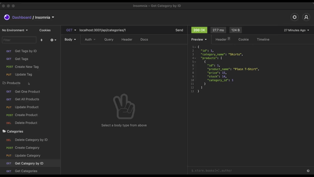

# eCommerce-backend

   

  ## Table of Contents
  * [Task](#task)
  * [Preview](#preview)
  * [Thoughts](#thoughts)
  * [Technologies Used](#technologies)
  * [Links](#links)

## Task :man_technologist:
For this assignment, we were tasked with creating an express application that stores information for an ecommerce site such as: Product, Tags. and Categories. The user is able to view all information or add, update and delete information through the backend. The information is displayed as JSON.

The app can be initiated by installing the necessary packages and calling __npm start__. 

## Preview
GET Requests

POST/PUT Requests

DELETE Requests

## Thoughts :thinking:
This was pretty difficult for me. I had a hard time figuring if something was wrong with my code. I kept running into the "Wrong Route" error, but I eventually figured it out. Thank goodness for video references, but I feel that I should've been able to figure it out without them.

## Technologies Used
Languages: Node.js

Packages: express, mysql2, sequelize

## Links
Repo: https://github.com/uzobeki/eCommerce-backend 

## Author
Uzochukwu Obeki